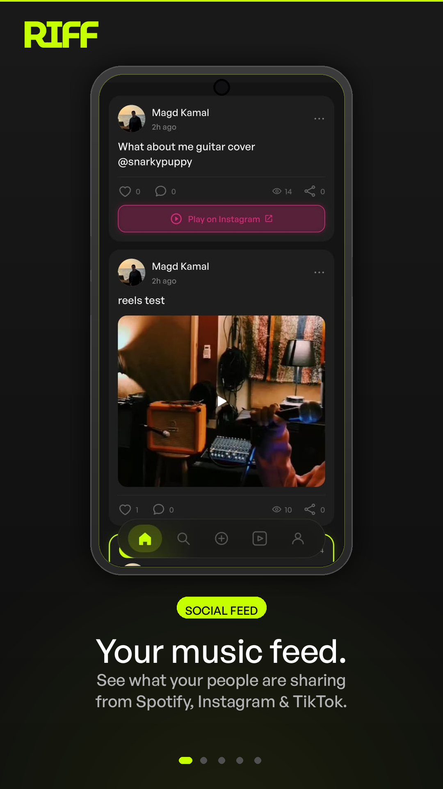
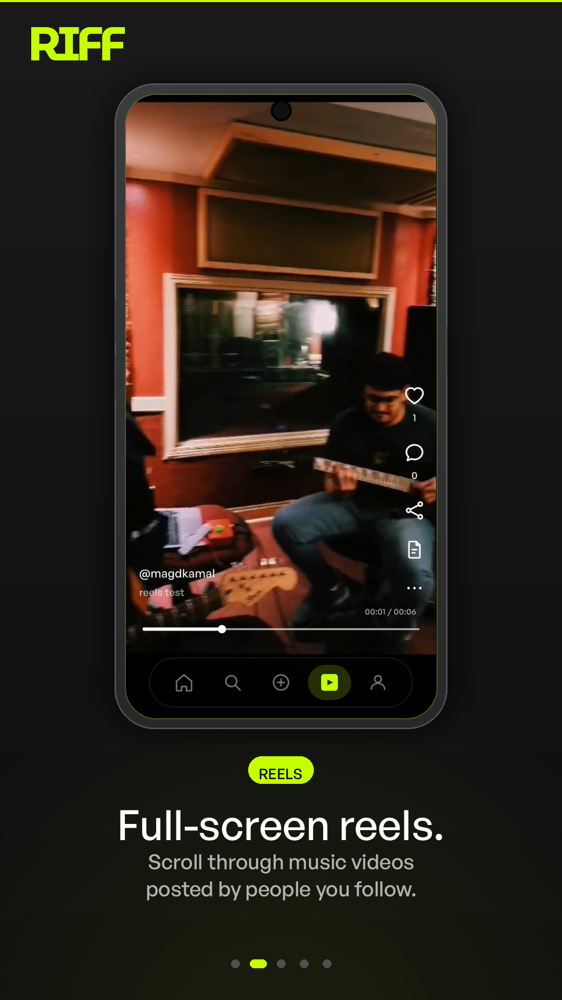
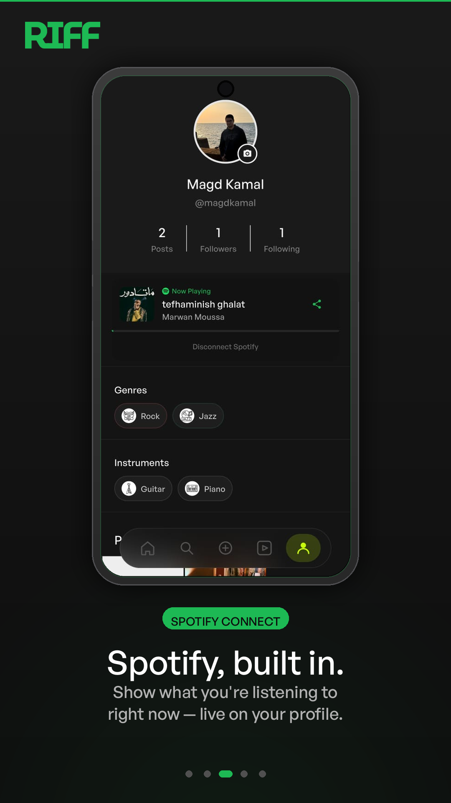
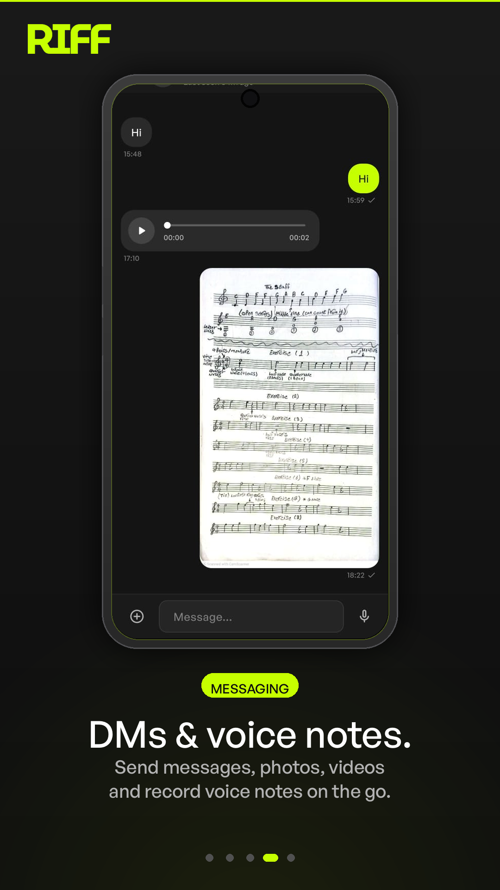
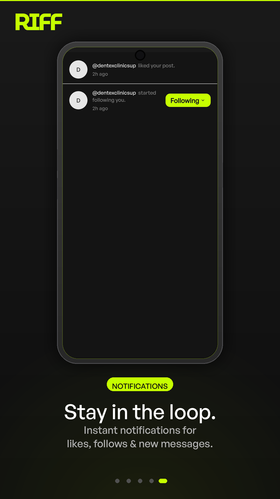

<p align="center">
  
</p>

<h1 align="center">Riff</h1>
<p align="center"><strong>Music is the language.</strong></p>

<p align="center">
  
  
  
  
  
</p>

<br />

<p align="center">
  
  
  
  
  
</p>

---

## What is Riff?

Most social apps treat music as an afterthought — a sticker, a sound clip, a link buried in a caption. Riff is built the other way around. Music is the reason you open it.

Riff is a social app where everything revolves around what you're listening to. Post a guitar cover from the studio. Share the Spotify track you've had on repeat all week. Drop a TikTok reel you just found. Your feed isn't an algorithm pushing strangers at you — it's the people you follow, sharing the music that's moving them right now.

It's for musicians, producers, music fans, and anyone who thinks a good playlist says more about a person than any status update ever could.

---

## Features

<br />

<table>
<tr>
<td width="62%" valign="top">

### Your music feed.

The home screen is a live stream of music moments from the people you follow. Posts can be videos, reels, or images — and every one of them is rooted in music.

Share an Instagram reel of a live performance. Post a clip from your own recording session. React, comment, and keep the conversation going. The feed is designed to feel like flipping through a friend's record collection: personal, curated, and always worth a scroll.

</td>
<td width="38%" align="center" valign="top">
  
</td>
</tr>
</table>

<br />

<table>
<tr>
<td width="38%" align="center" valign="top">
  
</td>
<td width="62%" valign="top">

### Full-screen reels.

Swipe up and you're in the reels feed — full-screen, immersive, and built for music video content. It's the same format that makes TikTok and Instagram Reels addictive, but here the content has a filter: it's music, always.

Watch someone shred a guitar solo. Catch a snippet from a gig. Discover a producer's breakdown of a beat. Every reel is posted by someone in your world, not surfaced by an algorithm trying to sell you something.

</td>
</tr>
</table>

<br />

<table>
<tr>
<td width="62%" valign="top">

### Spotify, built in.

Connect your Spotify account and Riff shows what you're listening to — live, on your profile. Not a last-played timestamp. Not a static playlist link. Your actual now-playing track, updated in real time.

Share a track directly from the Spotify app into Riff in two taps. It lands in the create-post screen already tagged with the artist, album and track name. Your followers see exactly what they need to find it and listen.

</td>
<td width="38%" align="center" valign="top">
  
</td>
</tr>
</table>

<br />

<table>
<tr>
<td width="38%" align="center" valign="top">
  
</td>
<td width="62%" valign="top">

### DMs & group chats.

Direct messages and group chats built for music people. Send a voice note when typing doesn't cut it. Drop an image from a rehearsal. Share a video straight from your camera roll.

Groups have a name, a photo, and a description — and if you're the admin, you can update all of it anytime. Add members, set the vibe, keep everyone in the loop. Voice notes are the fastest way to share what words can't: hold the mic, speak, send.

</td>
</tr>
</table>

<br />

<table>
<tr>
<td width="62%" valign="top">

### Stay in the loop.

A clean notifications screen that tells you exactly what happened: who liked your post, who started following you, and when a message came in. No noise, no dark patterns — just the information you actually want.

Push notifications are delivered via Firebase FCM, which means they reach you even when the app is closed. Like and follow counts update in real time so your profile always reflects the full picture.

</td>
<td width="38%" align="center" valign="top">
  
</td>
</tr>
</table>

---

## Tech Stack

| Layer | Technology |
|-------|-----------|
| Mobile | Flutter 3.44 · BLoC/Cubit · GetIt · Dio |
| API | NestJS · TypeORM · PostgreSQL |
| Hosting | Railway |
| Media | Cloudinary |
| Real-time | Socket.IO |
| Push | Firebase FCM |
| Music | Spotify Web API |

---

## Repository Layout

```
lib/
├── core/
│   ├── di/dependency_injection.dart   # GetIt registrations
│   ├── networks/
│   │   ├── api_constants.dart         # All endpoint strings
│   │   └── dio_factory.dart           # Dio + auth interceptor
│   ├── themes/                        # Colors, text styles
│   └── routing/routes.dart
└── features/
    ├── auth/
    ├── home/
    │   ├── chat/                      # DMs + group chat
    │   ├── feed/                      # Social feed
    │   └── reels/                     # Full-screen video
    ├── profile/
    ├── social_share/                  # Receive shares from other apps
    └── notifications/
```

Each feature follows the structure:
```
UI/           ← Screens and widgets
data/
  models/     ← Dart models (fromJson / toJson)
  repos/      ← Repository classes wrapping Dio
logic/
  cubit/      ← Cubit + State files
```

---

## Getting Started

### Flutter App

```bash
flutter pub get

# Run (development flavour)
flutter run --flavor development

# Build signed release AAB
flutter build appbundle --release --flavor production
```

### API

```bash
cd ../apis/riff
npm install

# Dev server
npm run start:dev

# Build + run DB migrations
npm run build && npm run migration:deploy
```

### Environment Variables

Create `.env` in the API root. Required keys:

```
DATABASE_URL=postgres://...
JWT_ACCESS_TOKEN_SECRET=
JWT_REFRESH_TOKEN_SECRET=
CLOUDINARY_CLOUD_NAME=
CLOUDINARY_API_KEY=
CLOUDINARY_API_SECRET=
FIREBASE_SERVICE_ACCOUNT_JSON=
SPOTIFY_CLIENT_ID=
SPOTIFY_CLIENT_SECRET=
```

---

## Architecture Notes

**State management** — BLoC/Cubit throughout. Each cubit lives in `logic/cubit/` and is registered in `dependency_injection.dart`.

**HTTP** — Dio instance from GetIt. All endpoint strings live in `ApiConstants`. A 401 response triggers a silent token refresh and retries the original request automatically.

**Real-time** — `ChatSocketService` wraps Socket.IO. Conversation rooms are identified by ID. A dedup guard in `ChatCubit.sendMedia()` prevents the socket broadcast arriving before the HTTP response from showing a message twice.

**Localization** — All UI strings are in `lib/l10n/intl_en.arb` (English) and `lib/l10n/intl_ar.arb` (Arabic). Run `flutter gen-l10n` after editing ARB files. Use `S.of(context).key` — never hardcode strings.

**Images** — Always `CachedNetworkImage` + `MediaUrl.resolve(url)`.

**Sizing** — `flutter_screenutil` — use `.w`, `.h`, `.r` everywhere.

---

## API Base URL

```
https://riff-production-08f7.up.railway.app
```

---

## License

Private — all rights reserved.
